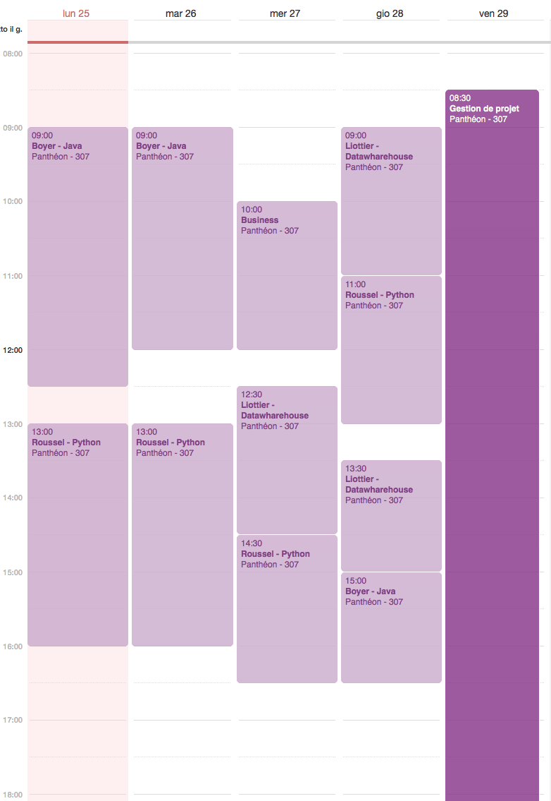

# Agenda

Équipe projet:
* Imane Nedjima Dahmani
* Li Deng
* Daniele Pitrolo
* Patrick Rivera

## Description

L'application permet de créer, modifier et afficher un agenda.

### Caractéristiques

* Possibilité de charger un agenda déjà créé
* Multi-utilisateur: au démarrage on demande avec quel utilisateur on veut accéder
* Un agenda peut être composé de plusieurs calendriers
* Différences dans l'affichage de chaque calendrier (couleur)
* Possibilité de lier un calendrier à une adresse mail de contact
* Possibilité d'ajouter un évènement
* Possibilité de reporter un évènement
* Composition d'un évènement
   * nom
   * lieu
   * participants
   * début et fin (possibilité de couvrir plusieurs jours à étudier)
   * Répétitions de l'évènement
      * Jamais
      * Tous les X jours
      * Tous les mois
      * Tous les ans
      * (Personnalisé: "tous les premier Lundi du mois")
      * fin de la répétition
   * Statut (occupé/libre)
   * Rappel
      * Début du rappel
      * périodicité du rappel
      (* modalité du rappel : mail, SMS, popup...)
   (* Privé/Pro : évènement ou calendrier peuvent être privé ou professionnel: ne serait-il plutôt à l'utilisateur de créer un calendrier PRO ou Privé?)
		OK Possibilité de définir un calendrier comme pro ou privé
   * Remarques pour l'évènement (cf. RFC 5545)
   * Pièce jointe (cf. RFC 5545)

* Une ou plusieurs personnes peuvent être associées à l'évènement
 * Fiche personne en vcard
 * Avant de fermer la session le programme montre une liste des personnes à prévenir. Les personnes à prévenir sont celles présentes dans des évènements créés ou bien modifiés.
* Calcul du total des heures
  * des évènements selectionnés
  * d'un calendrier

#### Tâches

L'agenda peut stocker des tâches, classées dans des calendriers.

* Possibilité de créer une tâche
* Composition d'une tâche
  * nom de la tâche
  * échéance
  * Evènement associé
  * rappel
    * périodicité du rappel
    * modalité du rappel
  * pièce jointe
  * priorité
* Rappel quotidien des tâches et évènements classé par échéance
* Possibilité de modifier et supprimer une tâche
* Possibilité d'affecter une tâche à un évènement

#### Export

* Possibilité d'exporter dans différents formats
    * export de l'agenda
    * export d'un projet
    * export d'un seul évènement ou tâche (sélection multiple possible)

### Base de données

La base de données stocke

* les utilisateurs
* les calendriers
* les évènements
* les fiches de personnes
* les tâches

### Fonctionnement de l'interface graphique

#### Les éléments de l'interface:

* Affichage des évènements et calendriers
* Un bouton pour créer un nouvel évènement
* Un bouton pour créer un nouveau calendrier
* Liste des calendriers créés avec case de sélection (afficher/cacher)
* Chaque évènement a une case qui peut être cochée ou décochée

#### Fonctionnement de l'interface:

Evènement:

* Un double clic sur l'évènement ouvre une fenêtre qui en montre les détails.
  * Un bouton permet de passer en mode *Modification*, un bouton permet de supprimer l'évènement
* En sélectionnant l'évènement on peut en faire un copier-coller
* En traînant les marges supérieures et inférieures de l'évènement on peut modifier son heure de début et de fin.

### Prolongements envisagés

* Envoi de courriels
* Une tâche a une durée estimée et une durée effectuée.
* Possibilité d'associer à un évènement une tâche. La durée effectuée de la tâche changera donc en incrémentant de la durée de l'évènement. Si plusieurs tâches sont assignées à un évènement, elles auront une incrémentation  de durée effectuée égale à la durée de l'évènement / n. de tâches.
* L'utilisateur peut manuellement changer la durée effectuée totale ainsi qu'incrémenter manuellement la durée effectuée.
